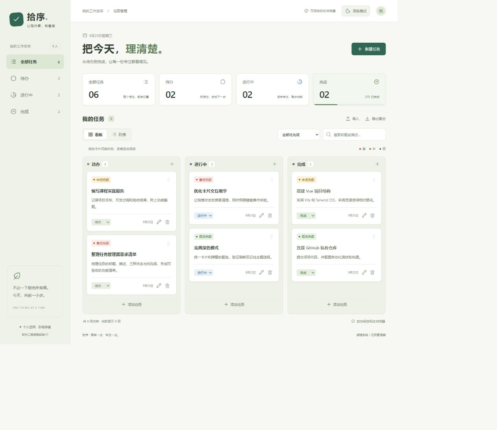
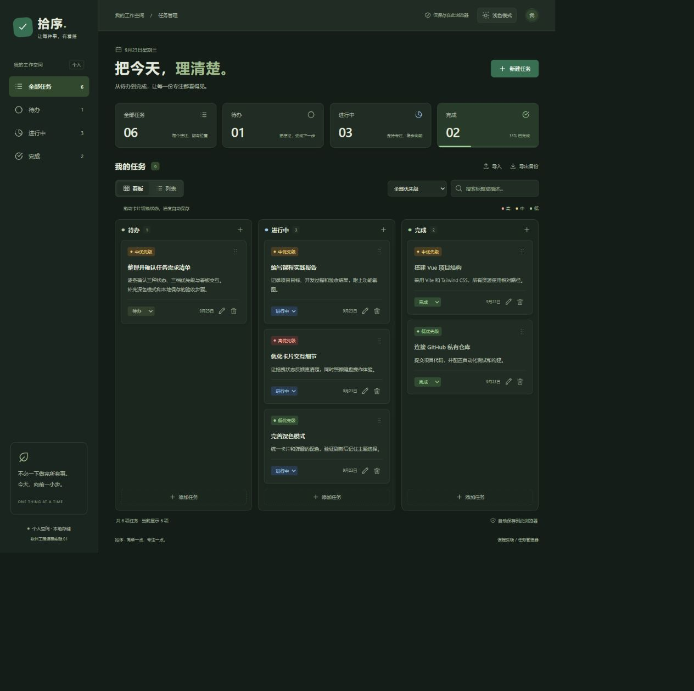
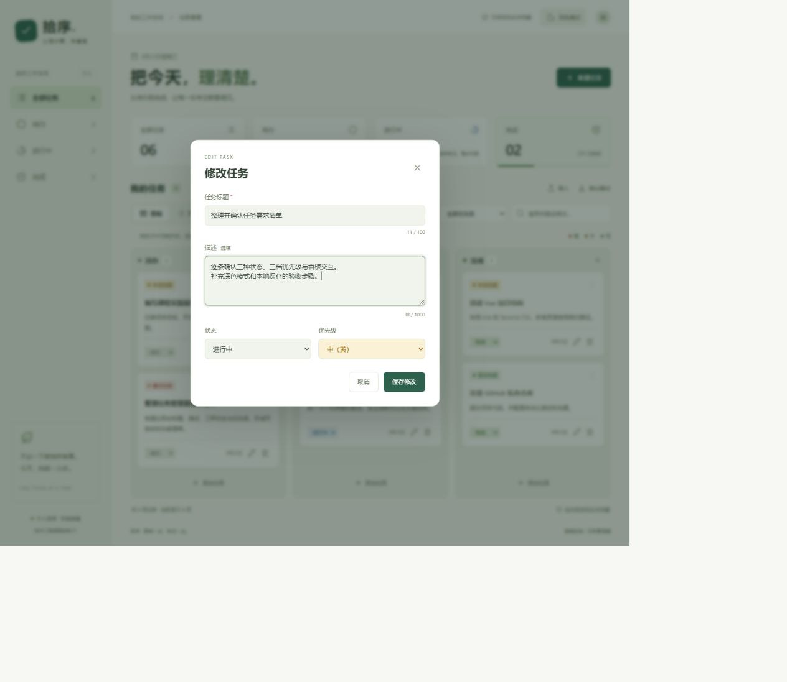

# 功能界面演示

本目录为浏览器实际运行截图，使用独立本地预览中的演示任务。拍摄日期：2026-09-23。演示操作不会把示例任务混入日常使用地址的个人数据。

## 截图索引

| 截图 | 演示内容 |
| --- | --- |
| [01-empty-board.jpg](./01-empty-board.jpg) | 首次打开的空看板，待办 / 进行中 / 完成三列 |
| [02-create-validation.jpg](./02-create-validation.jpg) | 标题未填写时阻止创建并显示提示 |
| [03-create-task.jpg](./03-create-task.jpg) | 创建任务：标题、选填描述、状态及高（红）优先级 |
| [04-board-light.jpg](./04-board-light.jpg) | 浅色看板，三列任务及高红 / 中黄 / 低绿优先级 |
| [05-task-details.jpg](./05-task-details.jpg) | 查看完整描述、状态、优先级和时间信息 |
| [06-edit-task.jpg](./06-edit-task.jpg) | 同时修改标题、描述、状态及优先级 |
| [07-delete-confirm.jpg](./07-delete-confirm.jpg) | 删除确认，可保留任务或确认删除 |
| [08-list-filter-search.jpg](./08-list-filter-search.jpg) | 列表中组合状态、优先级和描述关键词筛选 |
| [09-board-after-drag.jpg](./09-board-after-drag.jpg) | 鼠标把“编写课程实践报告”从待办拖到进行中后的结果 |
| [10-board-dark.jpg](./10-board-dark.jpg) | 切换深色模式并刷新后，主题和任务状态仍保留 |
| [11-edit-dark.jpg](./11-edit-dark.jpg) | 深色模式下的编辑弹窗和低（绿）优先级 |
| [12-mobile-list.jpg](./12-mobile-list.jpg) | 手机宽度下的列表布局 |
| [13-backup-import.jpg](./13-backup-import.jpg) | 导入 5 项演示任务后的成功提示 |
| [14-empty-search.jpg](./14-empty-search.jpg) | 搜索无结果时的空状态和清除筛选入口 |
| [15-list-light.jpg](./15-list-light.jpg) | 浅色列表完整任务概览 |
| [16-mobile-board.jpg](./16-mobile-board.jpg) | 手机宽度下可横向滚动的看板 |

## 看板

## 任务编辑

## 验收记录

- 10 项自动测试通过：标题/描述边界、三状态/三优先级保存、任务编辑、状态往返、删除持久化、旧版数据迁移、损坏数据保护、存储异常、导入去重及主题记忆。
- 浏览器验证通过：空标题与空白标题拦截、描述选填、创建、详情、修改、取消删除、确认删除、刷新保留。
- 使用真实鼠标拖拽，将“编写课程实践报告”移入进行中列，刷新后确认仍在该列。
- 浏览器验证通过：联合搜索和筛选、无结果提示、备份导入、深色刷新恢复、多标签页主题同步。
- 手机宽度下检查列表及看板：页面本身无横向溢出，看板内部可以横向滚动。触屏把手拖动已实现；本次浏览器验收使用鼠标及模拟窄屏，未做实体触屏设备测试。

截图按操作过程拍摄，因此个别任务的标题、优先级及列内数量会随编辑和拖拽而改变。截图是展示素材，不参与应用运行。
